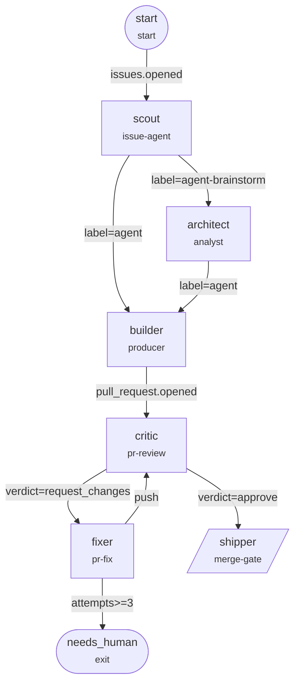

<!-- GENERATED FROM harness.dot — DO NOT EDIT. Run `gp-foundry build`. -->

# dixie — harness

```mermaid
flowchart TD
  start(["start<br/><small>start</small>"])
  scout["scout<br/><small>issue-agent</small>"]
  architect["architect<br/><small>analyst</small>"]
  builder["builder<br/><small>producer</small>"]
  critic["critic<br/><small>pr-review</small>"]
  fixer["fixer<br/><small>pr-fix</small>"]
  shipper[/"shipper<br/><small>merge-gate</small>"/]
  needs_human(["needs_human<br/><small>exit</small>"])
  start -->|"issues.opened"| scout
  scout -->|"label=agent-brainstorm"| architect
  scout -->|"label=agent"| builder
  architect -->|"label=agent"| builder
  builder -->|"pull_request.opened"| critic
  critic -->|"verdict=approve"| shipper
  critic -->|"verdict=request_changes"| fixer
  fixer -->|"push"| critic
  fixer -->|"attempts>=3"| needs_human
```
