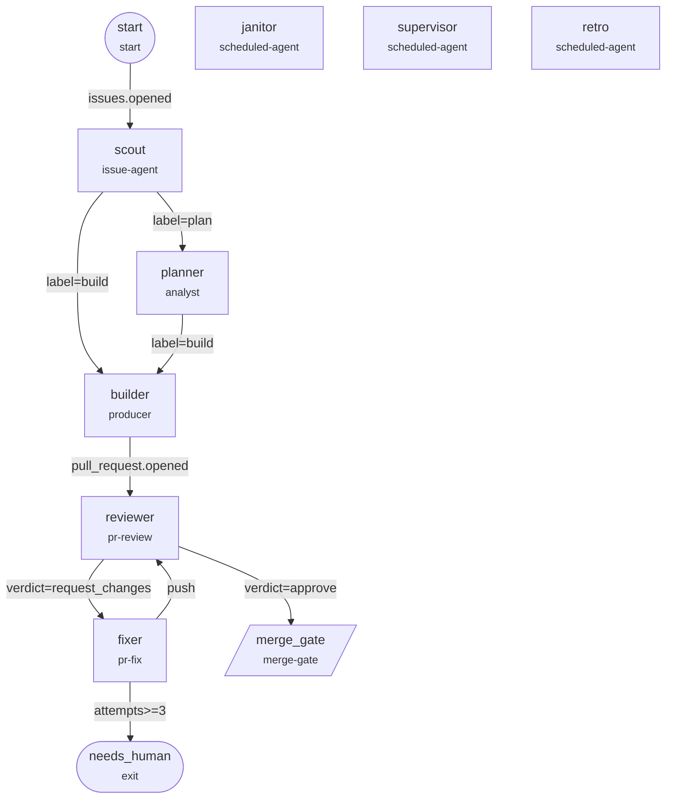

<!-- GENERATED FROM harness.dot — DO NOT EDIT. Run `gp-foundry build`. -->

# starter — agent harness

```mermaid
flowchart TD
  start(["start<br/><small>start</small>"])
  scout["scout<br/><small>issue-agent</small>"]
  planner["planner<br/><small>analyst</small>"]
  builder["builder<br/><small>producer</small>"]
  reviewer["reviewer<br/><small>pr-review</small>"]
  fixer["fixer<br/><small>pr-fix</small>"]
  merge_gate[/"merge_gate<br/><small>merge-gate</small>"/]
  janitor["janitor<br/><small>scheduled-agent</small>"]
  supervisor["supervisor<br/><small>scheduled-agent</small>"]
  retro["retro<br/><small>scheduled-agent</small>"]
  needs_human(["needs_human<br/><small>exit</small>"])
  start -->|"issues.opened"| scout
  scout -->|"label=plan"| planner
  scout -->|"label=build"| builder
  planner -->|"label=build"| builder
  builder -->|"pull_request.opened"| reviewer
  reviewer -->|"verdict=approve"| merge_gate
  reviewer -->|"verdict=request_changes"| fixer
  fixer -->|"push"| reviewer
  fixer -->|"attempts>=3"| needs_human
```
